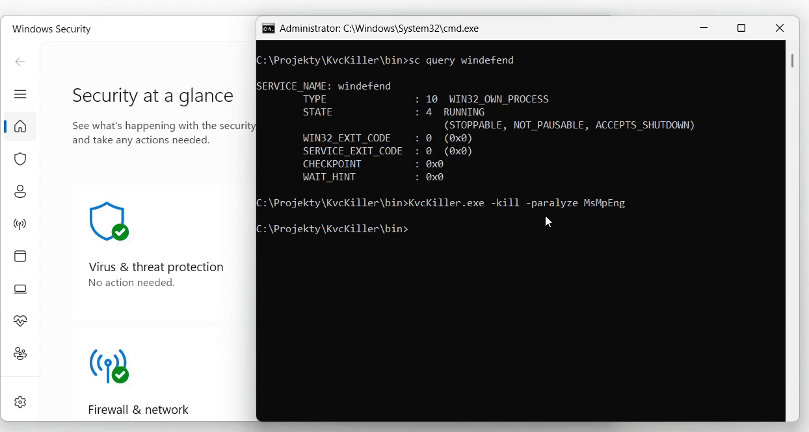
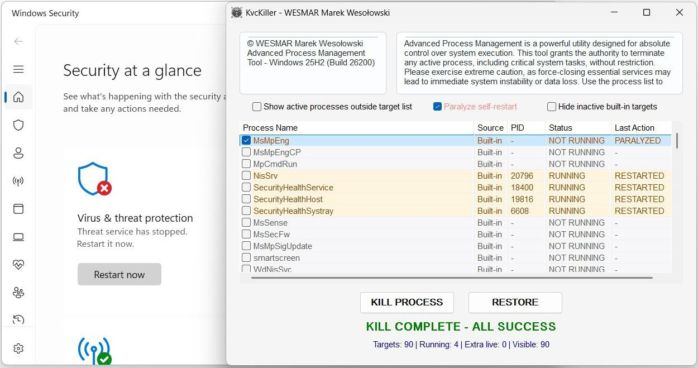
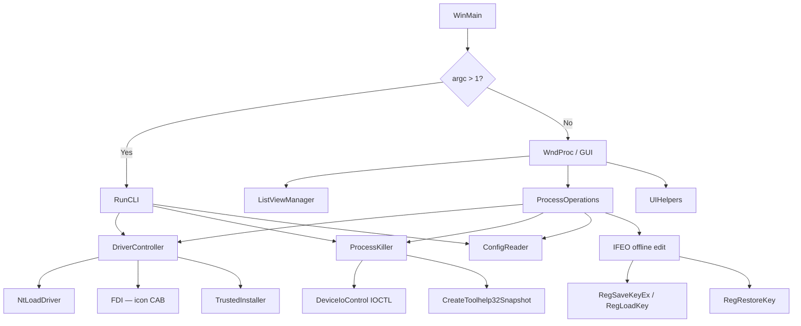
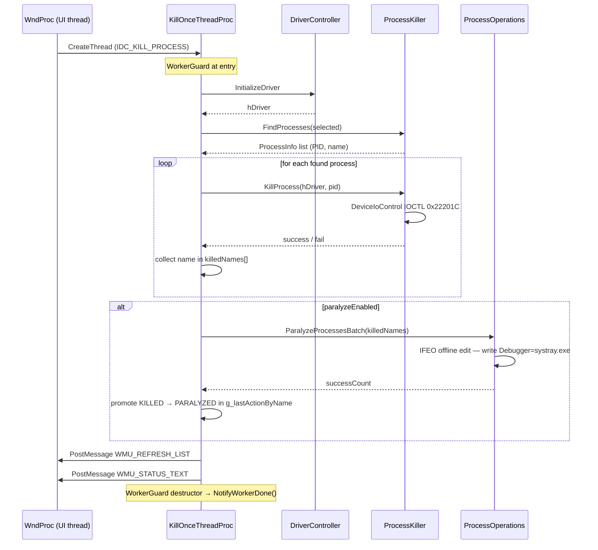
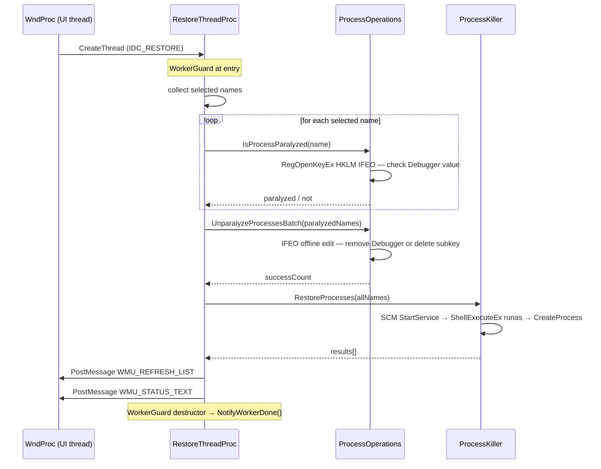

<div align="center">

# KvcKiller

**Advanced Process Management Tool for Windows x64**

Kernel-mode AV/EDR process termination · IFEO Paralyze · SCM Restore · Headless CLI


[](LICENSE.md)

[**Download KvcKiller.7z**](../../releases/latest/download/KvcKiller.7z) &nbsp;·&nbsp; Password: `github.com`

</div>

<div align="center">

**CLI — terminal demo**



**GUI — main window**



</div>

---

## Table of Contents

- [Feature Overview](#feature-overview)
- [Architecture](#architecture)
- [Driver Lifecycle](#driver-lifecycle)
- [Kill Flow](#kill-flow)
- [Paralyze: IFEO Offline Editing](#paralyze-ifeo-offline-editing)
  - [What IFEO Does](#what-ifeo-does)
  - [Why Direct IFEO Write Fails](#why-direct-ifeo-write-fails)
  - [The Offline Hive Editing Trick](#the-offline-hive-editing-trick)
  - [The MsMpEng Phenomenon](#the-msmpeng-phenomenon)
- [Restore Flow](#restore-flow)
- [Built-in Target List](#built-in-target-list)
- [GUI Reference](#gui-reference)
- [CLI Reference](#cli-reference)
- [Registry & Configuration](#registry--configuration)
- [Module Map](#module-map)
- [Build](#build)
- [Security Notes](#security-notes)
- [System Requirements](#system-requirements)

---

## Feature Overview

KvcKiller terminates AV/EDR processes that protect themselves against user-space
`TerminateProcess` calls by dispatching kills through a kernel driver via `DeviceIoControl`.
Self-protection at ring 3 is irrelevant when the termination signal arrives from ring 0.

### Kill Engine

- **Kernel IOCTL termination** — driver handle opened to `\\.\Warsaw_PM`; PID sent via
  `DeviceIoControl` (IOCTL `0x22201C`); process terminated from ring 0
- **Driver stealth loading** — `NtLoadDriver` / `NtUnloadDriver` via direct NTDLL calls; no
  `CreateService`, no visible entry in `services.msc` during the session
- **Privilege escalation** — `RtlAdjustPrivilege` for `SeLoadDriverPrivilege` and
  `SeDebugPrivilege`; TrustedInstaller impersonation for DriverStore writes
- **Driver embedded in icon** — the kernel driver is compressed as an **LZX Cabinet archive**
  (equivalent to `makecab /D CompressionType=LZX /D CompressionMemory=21 /D MaxDiskSize=0`)
  and appended to `KvcKiller.ico`; extracted on demand via the Windows FDI API; no separate
  `.sys` file to distribute or detect

### Paralyze Mode

- Injects `Debugger = C:\Windows\System32\systray.exe` into **Image File Execution Options**
  for each target process — Windows intercepts every subsequent launch and runs the dummy
  debugger instead; no AV code ever executes
- `systray.exe` is chosen deliberately: it is a legitimate system binary (Windows System Tray
  host), carries a Microsoft signature, and exits silently when invoked with unexpected
  arguments — making the interception less suspicious than a non-existent path
- Survives application restart: on next launch, KvcKiller reads IFEO and restores the
  **PARALYZED** state in the UI without any separate persistence file
- Reversed by Restore — the IFEO entry is removed before the service is restarted
- Temp files created during the offline hive edit (`C:\Windows\Temp\Ifeo.hiv`,
  `.LOG1`, `.LOG2`, `.blf`, `*.regtrans-ms`) are cleaned up after each operation

### Restore

- Removes the IFEO Debugger entry (unparalyze) before any launch attempt
- Restarts via **SCM StartService** → **ShellExecuteEx (runas)** → direct **CreateProcess**
- Batch restore for all selected targets; path resolved from live
  `QueryFullProcessImageNameW` or HKCU path cache

### GUI

- Win32 ListView with 5 columns (Process Name, Source, PID, Status, Last Action),
  click-to-sort
- Dark / light mode auto-detected; **Mica backdrop** on Windows 11; animated **sine-pulse**
  Paralyze label
- **PARALYZED** row state: orange color, distinct from red KILLED, persists across restarts
- "Show extra processes" — appends running processes not in the config list
- "Hide inactive built-in targets" — collapses not-running entries with no pending action
- Worker threads for kill and restore; atomic shutdown coordination; UI stays responsive

### CLI

Single binary, dual mode — GUI when launched without arguments, headless console tool with
arguments. No separate CLI binary.

---

## Architecture



```
WinMain
  ├─ argc > 1  →  RunCLI (headless, AttachConsole)
  └─ GUI mode
       ├─ WndProc
       │    ├─ WM_CREATE     →  InitListView, RefreshProcessList, timers
       │    ├─ WM_COMMAND    →  KillOnceAction / RestoreAction (worker threads)
       │    ├─ WM_NOTIFY     →  HandleListCustomDraw, sort on LVN_COLUMNCLICK
       │    ├─ WM_CLOSE      →  set g_shutdownPending; defer DestroyWindow if workers active
       │    └─ WM_PAINT      →  PaintHeaderPanels (custom rounded rects)
       ├─ UIHelpers           (fonts, dark mode, Mica, DPI-aware layout)
       ├─ ListViewManager     (columns, custom draw, row flag bits, IFEO cold-start check)
       ├─ ProcessOperations   (worker threads, IFEO paralyze/unparalyze, driver init)
       ├─ ProcessKiller       (FindProcesses, KillProcess, RestoreProcesses)
       ├─ DriverController    (FDI extract → DriverStore → NtLoad → IOCTL → NtUnload)
       └─ ConfigReader        (HKCU registry: target list, path cache, history ring buffer)
```

### Thread Model

Worker threads (`KillOnceThreadProc`, `RestoreThreadProc`) are created via `CreateThread` from
`WM_COMMAND`. `g_activeWorkers` (atomic int) counts live workers; `g_shutdownPending` (atomic
bool) signals them to exit cleanly. `WM_CLOSE` defers `DestroyWindow` until
`g_activeWorkers == 0` — the window never closes mid-operation. The last worker to exit during
shutdown re-posts `WM_CLOSE` to unblock the message loop.

A `WorkerGuard` RAII struct placed at the top of every thread proc guarantees
`g_activeWorkers` is decremented on all exit paths, including early returns and exception
unwinds.

Cross-thread UI updates use `PostMessage(WMU_STATUS_TEXT)` with a heap-allocated
`std::wstring*`; the message handler owns and deletes it. The paralyze checkbox state is read
on the UI thread in `KillOnceAction` and passed to the worker via `KillThreadParams` — no
cross-thread `SendMessage` is needed.

`g_lastActionByName` and `g_prevRunningByName` are guarded by `g_statusLock`
(`CRITICAL_SECTION`).

---

## Driver Lifecycle

```mermaid
flowchart LR
    A[KillOnceAction] --> B[InitializeDriver]
    B --> C{Already loaded?}
    C -->|Yes| G
    C -->|No| D[ExtractDriverFromIcon]
    D --> E[FDI — icon LZX CAB → DriverStore]
    E --> F[TrustedInstaller impersonation]
    F --> G[RegisterDriver — SCM registry key]
    G --> H[RtlAdjustPrivilege SeLoadDriver]
    H --> I[NtLoadDriver]
    I --> J[GetDriverHandle — open Warsaw_PM]
    J --> K[DeviceIoControl IOCTL kill loop]
    K --> L[CloseDriverHandle]
    L --> M[NtUnloadDriver]
    M --> N[CleanupDriverRegistry]
```



**Driver extraction**

The kernel driver binary is stored as an LZX-compressed Cabinet block appended to
`KvcKiller.ico` (the application icon, embedded as `MAIN_ICON` in the RC file). The
compression is equivalent to:

```
makecab /D CompressionType=LZX /D CompressionMemory=21 /D MaxDiskSize=0
```

On each Kill operation, `ExtractDriverFromIcon`:
1. Reads the icon bytes from the PE resource section via `FindResource` / `LockResource`
2. Scans for the `MSCF` Cabinet signature within the icon binary
3. Sets up a `MemoryReadContext` and calls `FDICopy` with all-in-memory FDI callbacks
   (`fdi_read`, `fdi_seek`, `fdi_write`, `fdi_open`, `fdi_close`)
4. Writes the extracted `.sys` to the DriverStore path using a HANDLE opened under
   TrustedInstaller impersonation

`NtLoadDriver` / `NtUnloadDriver` are called directly from `ntdll.lib` — no
`CreateService`, no SCM interaction, no visible service entry.

---

## Kill Flow



| Step | Detail |
|------|---------|
| **Discovery** | `CreateToolhelp32Snapshot(TH32CS_SNAPPROCESS)` + `Process32FirstW/NextW`; matched by base exe name, case-insensitive |
| **IOCTL** | `DeviceIoControl(hDriver, 0x22201C, buffer, 1036, nullptr, 0, ...)` — PID in first 4 bytes, 1032 bytes zero-padding required by the driver's dispatch handler |
| **Confirmation** | `IsProcessRunning(pid)` via `WaitForSingleObject(hProcess, 0)` — process object is signalled the instant it exits, more reliable than re-snapshotting |
| **State** | `g_lastActionByName[key] = kActionKilled`; promoted to `kActionParalyzed` if IFEO write succeeded |

---

## Paralyze: IFEO Offline Editing

### What IFEO Does

**Image File Execution Options** (`HKLM\SOFTWARE\Microsoft\Windows NT\CurrentVersion\Image
File Execution Options`) is a Windows mechanism originally designed for attaching a debugger to
a process at startup. When a `Debugger` value is present under a process's IFEO subkey, the
Windows loader (`ntdll!LdrpInitializeProcess`) checks for it before transferring control to
the image entry point. If found, it launches the registered debugger binary with the original
command line appended — and the original process never runs.

KvcKiller writes `Debugger = C:\Windows\System32\systray.exe`. When the AV service manager
issues `StartService`, the Windows loader intercepts the launch and runs `systray.exe` instead.
`systray.exe` is the System Tray notification area host — when invoked with unexpected
arguments it exits immediately. From SCM's perspective the service "started and exited with
code 0", which does not trigger service recovery restart logic. No AV code executed.

`systray.exe` is chosen over a non-existent path or a custom binary because it:
- Carries a valid Microsoft Authenticode signature
- Is present on every Windows installation
- Exits cleanly without error dialogs or event log entries

### Why Direct IFEO Write Fails

Attempting to write `Debugger` directly to a live IFEO subkey with `RegSetValueExW` returns
`ERROR_ACCESS_DENIED` (error 5), even from an Administrator process with both
`SeRestorePrivilege` and `SeBackupPrivilege` enabled.

The root cause is the DACL on individual IFEO subkeys. On Windows 10/11, Microsoft tightens
the ACLs on IFEO entries for Defender components (`MsMpEng.exe`, `NisSrv.exe`, etc.) so that
only `NT AUTHORITY\SYSTEM` and `NT SERVICE\TrustedInstaller` hold write access. Security
vendors (CrowdStrike, SentinelOne, ESET, Kaspersky) extend this by adding explicit deny ACEs
for their own IFEO entries as part of their self-protection stack — blocking writes even from
a TrustedInstaller-impersonating token, since TrustedInstaller SID must appear in the DACL
grant specifically for each subkey.

**The core problem: you cannot reliably write `Debugger` to live IFEO for protected processes
regardless of privilege level.** Privilege escalation is a dead end here because the ACLs
are evaluated per-key, not per-privilege.

### The Offline Hive Editing Trick

The solution is to never touch the live IFEO key directly. Instead:

```
Step 1 — RegSaveKeyEx
  Save HKLM\...\Image File Execution Options → C:\Windows\Temp\Ifeo.hiv

  Reads the entire IFEO subtree into a flat hive file on disk.
  Requires SE_BACKUP_NAME — backup privilege bypasses DACL on read.
  The per-subkey ACLs that blocked direct writes are irrelevant here.

Step 2 — RegLoadKey
  Load Ifeo.hiv → HKLM\TempIFEO

  Mounts the saved hive file as a new root key under HKLM.
  Critically: the mounted key's effective DACL is inherited from the
  parent HKLM node, NOT from the original IFEO subkey ACLs.
  The calling Administrator process has full KEY_ALL_ACCESS on TempIFEO.

Step 3 — Edit offline
  RegCreateKeyExW / RegSetValueExW / RegDeleteKeyW on HKLM\TempIFEO\...

  All operations succeed — no ACL enforcement from original IFEO DACLs.
  The hive file is modified with the new Debugger entries.

Step 4 — RegUnLoadKey
  Unmount HKLM\TempIFEO

  Flushes all changes to Ifeo.hiv and releases the mount.

Step 5 — RegRestoreKey (REG_FORCE_RESTORE)
  Restore Ifeo.hiv → HKLM\...\Image File Execution Options

  Atomically replaces the entire live IFEO subtree with the modified hive.
  REG_FORCE_RESTORE overrides the target key's DACL for this operation.
  Requires SE_RESTORE_NAME.

Step 6 — Cleanup
  Delete C:\Windows\Temp\Ifeo.hiv, Ifeo.hiv.LOG1, Ifeo.hiv.LOG2,
         Ifeo.hiv.blf, *.regtrans-ms
```

This approach works because `RegRestoreKey` with `REG_FORCE_RESTORE` is a legitimate
backup/restore API that predates Windows NT 4.0. The `SE_BACKUP_NAME` + `SE_RESTORE_NAME`
privilege pair is intentionally granted to Administrator accounts to allow system backup
software (Veeam, VSS, Windows Backup) to preserve and restore registry hives without DACL
interference. Microsoft cannot restrict these privileges without breaking every backup solution
on Windows.

**IFEO ownership tracking:** A value under `HKCU\Software\KvcKiller` records which IFEO
entries were created by KvcKiller (value name = `ProcessName.exe`, type `REG_DWORD`, data `1`)
versus which already existed. On unparalyze, only KvcKiller-created subkeys are deleted
entirely; for pre-existing subkeys, only the `Debugger` value is removed. This avoids
destroying legitimate IFEO entries placed by other tools.

### The MsMpEng Phenomenon

`MsMpEng.exe` (Windows Defender's antimalware engine) is the canonical demonstration case for
why Paralyze is necessary alongside Kill.

After a kernel-mode kill, `WinDefend` (the Defender service) detects that `MsMpEng.exe` exited
and issues `StartService` within milliseconds. Additionally:

- `SecurityHealthService` monitors Defender health and can trigger restarts independently
- `WdNisSvc` (Network Inspection Service) shares a service group and influences restart timing
- SCM service recovery settings for `WinDefend` specify immediate restart on failure
- On Windows 11, Defender processes carry **PPL-Antimalware** (Protected Process Light) flags

Without Paralyze, `MsMpEng.exe` is back within 1–3 seconds of the kill. With Paralyze:

1. KvcKiller sends the IOCTL kill — `MsMpEng.exe` is terminated at ring 0
2. `WinDefend` calls `StartService` → loader checks IFEO →
   finds `Debugger = systray.exe` → runs `systray.exe` → exits with code 0
3. SCM records "service started and exited normally" — recovery restart logic does not trigger
4. `SecurityHealthService` sees a clean exit, does not escalate
5. Defender stays dead until Restore explicitly removes the IFEO entry and calls `StartService`

The same mechanism works for CrowdStrike (`CSFalconService`), SentinelOne (`SentinelAgent`),
ESET (`ekrn`), Kaspersky (`avp`), and all other AV/EDR engines that restart via SCM — because
it targets the **Windows loader**, not the service manager. The loader always checks IFEO
before transferring control, regardless of how the process was started.

---

## Restore Flow



`ProcessKiller::RestoreProcesses` tries three methods in order, stopping at the first success:

| Method | When used |
|--------|-----------|
| **SCM StartService** | Process is registered as a Win32 service (covers most AV/EDR) |
| **ShellExecuteEx** with `runas` | GUI apps and self-elevating executables |
| **CreateProcess** | Fallback using the HKCU path cache |

The executable path is resolved from (priority order):
1. Live `QueryFullProcessImageNameW` on the running PID — updated on every refresh cycle
2. `ConfigReader::ReadProcessPath` from the HKCU path cache
3. `QueryServiceConfigW` → `lpBinaryPathName` from the SCM service entry

`IsProcessParalyzed` reads `HKLM\...\Image File Execution Options\<name.exe>\Debugger` directly
at restore time, so the correct unparalyze path is taken even when the PARALYZED state was set
in a previous session.

---

## Built-in Target List

Compiled into the binary as `IDR_DEFAULT_TARGETS RCDATA "KvcKiller.ini"` and written to HKCU
on first run. The resource loader handles three encodings automatically: **UTF-16 LE with BOM**
(direct cast), **UTF-8 with BOM** (skip 3-byte marker, convert via `MultiByteToWideChar`), and
**plain UTF-8 / ANSI** (CP_UTF8 first, fall back to `CP_ACP` if invalid sequence detected).

90+ targets across 15 vendors:

| Vendor | Processes |
|--------|-----------|
| **Microsoft Defender / Sentinel / Sense** | MsMpEng, MsMpEngCP, MpCmdRun, NisSrv, SecurityHealthService, SecurityHealthHost, SecurityHealthSystray, MsSense, MsSecFw, MsMpSigUpdate, smartscreen, WdNisSvc, WinDefend, Sense, SenseIR, SenseCncProxy, MsColleciton, MpNWMon |
| **Avast / AVG** | AvastSvc, AvastUI, aswEngSrv, aswToolsSvc, avg, avgui, avgsvc, avgidsagent |
| **Bitdefender** | vsserv, bdservicehost, bdagent, bdwtxag, updatesrv, bdredline, bdscan, seccenter |
| **Carbon Black (VMware)** | cb, RepMgr, RepUtils, RepWsc |
| **CrowdStrike** | CSFalconService, CSFalconContainer |
| **Cylance (BlackBerry)** | CylanceSvc, CylanceUI |
| **ESET** | ekrn, egui, ema_client, ekrnui, elam |
| **FireEye / Trellix** | xagt, FireEye |
| **Kaspersky** | avp, avpui, klnagent, kavfs, kavfsslp, kmon, ksde, kavtray |
| **Malwarebytes** | mbamservice, mbam, mbamtray |
| **McAfee** | McAfeeService, McAPExe, mcshield, mfemms, mfeann, mcagent, mctray |
| **Norton / Symantec** | ccSvcHst, nortonsecurity, symantec, Smc, SNAC, SymCorpUI |
| **SentinelOne** | SentinelAgent, SentinelMonitor, SentinelServiceHost, SentinelHelperService, SentinelBrowserNative |
| **Sophos** | SavService, SophosHealth, SophosCleanService, SophosFileScanner, SophosSafestore64, SophosMcsAgent, SophosEDR |
| **Trend Micro** | TMBMSRV, NTRTScan, TmListen, TmProxy, TmPfw |

Custom targets can be added to `HKCU\Software\KvcKiller\Targets` or by editing
`KvcKiller.ini` before first run.

---

## GUI Reference

### Window Layout

| Panel | Content |
|-------|---------|
| Header left | © WESMAR Marek Wesołowski · Advanced Process Management Tool – Windows 11 24H2 |
| Header right | Warning / status banner |
| **Process Name** · Source · PID · Status · Last Action | MsMpEng · Built-in · 4812 · RUNNING · `-` |
| | CylanceSvc · Built-in · — · NOT RUNNING · `KILLED` |
| | MsMpEng · Built-in · — · NOT RUNNING · `PARALYZED` |
| Checkboxes | ☐ Show active processes outside target list |
| | ☐ Hide inactive built-in targets |
| | ☐ ~~~Paralyze self-restart~~~  `[KILL PROCESS]`  `[RESTORE]` |
| Footer | READY · 90 targets · 3 running · 2 extra |

### ListView Columns

| Column | Width | Description |
|--------|-------|-------------|
| **Process Name** | Flexible | Base executable name from `CreateToolhelp32Snapshot` |
| **Source** | 60 px | `Built-in` (from config) or `Saved` (extra, added dynamically) |
| **PID** | 68 px | Live PID; `—` when not running |
| **Status** | 118 px | `RUNNING` / `NOT RUNNING`; color-coded via `NM_CUSTOMDRAW` |
| **Last Action** | 120 px | `KILLED` / `PARALYZED` / `RESTORED` / `RESTARTED` / `LIVE` / `RESTORING` / `-` |

### Row Colors (NM_CUSTOMDRAW)

| State | Dark mode | Light mode |
|-------|-----------|------------|
| **RUNNING** | Green text / dark green bg | Green text / light green bg |
| **KILLED** | Red text / dark red bg | Dark red text / light red bg |
| **PARALYZED** | Orange text / dark orange bg | Dark orange text / light orange bg |
| **RESTORED / RESTARTED** | Blue text / dark blue bg | Blue text / light blue bg |
| **NOT RUNNING (no action)** | Gray text | Gray text |

PARALYZED is evaluated before KILLED in the custom draw chain — the more specific state wins.

### Row Flag Bits (LVITEM::lParam)

| Flag | Value | Meaning |
|------|-------|---------|
| `kRowFlagRunning` | 0x0001 | Process is currently running |
| `kRowFlagExtra` | 0x0002 | Not in config; added by "Show extra" |
| `kRowFlagKilled` | 0x0004 | Was killed this session |
| `kRowFlagRestored` | 0x0008 | Was restored this session |
| `kRowFlagRestarted` | 0x0010 | Restarted on its own after kill |
| `kRowFlagParalyzed` | 0x0020 | Killed and has IFEO Debugger entry blocking restart |

### PARALYZED State Persistence

PARALYZED is the only action state that persists across application restarts without a separate
persistence file. IFEO is the source of truth. On startup, `RefreshProcessList` calls
`IsProcessParalyzed(name)` for each not-running process with no stored action. If the IFEO
`Debugger` value is found, the row is initialised with `kActionParalyzed` and
`kRowFlagParalyzed`.

KILLED state is intentionally not persisted across restarts: when KvcKiller exits, the killed
process may already be restarting (or may have already come back up). Showing a stale KILLED
label on next launch without knowing actual current state would be misleading.

### Paralyze Label Animation

The Paralyze checkbox label pulses in red using a sine wave tied to `GetTickCount64`. A 40 ms
`WM_TIMER` invalidates only the label HWND; `WM_CTLCOLORSTATIC` recalculates the text color
each frame:

```
f = 0.5 + 0.5 * sin(t * 2π / period)
R = lerp(bgR, 255, f * 0.9 + 0.1)
G = lerp(bgG,  40, f * 0.9 + 0.1)
B = lerp(bgB,  40, f * 0.9 + 0.1)
```

Pure color interpolation, no alpha blending, no GDI+ — compatible with all Win32 themes and
both dark/light mode. Background color sourced from `g_windowColor` so the animation blends
correctly in both themes.

---

## CLI Reference

Because KvcKiller is compiled as a `/SUBSYSTEM:WINDOWS` GUI binary, it cannot simply write to
`stdout` when launched from a terminal. On entry to `RunCLI`, `SetupConsole` calls
`AttachConsole(ATTACH_PARENT_PROCESS)` — this attaches to the *existing* console of the
parent process (the `cmd.exe` or PowerShell session that launched KvcKiller) without opening a
new window. File descriptors are re-opened against `CONOUT$` / `CONIN$` and
`_setmode(_O_U16TEXT)` is set so `wprintf` outputs correct Unicode on all code pages.

When `RunCLI` finishes, `SendEnterToConsole` injects a synthetic key-down + key-up event for
`VK_RETURN` into the console input buffer via `WriteConsoleInputW`. Without this, the parent
shell never receives a signal that the GUI-subsystem process finished — from `cmd.exe`'s
perspective KvcKiller launched asynchronously and returned immediately, leaving the prompt
missing. The synthetic Enter forces `cmd.exe` and PowerShell to redraw the prompt line.

```
KvcKiller.exe -help
KvcKiller.exe -list
KvcKiller.exe -kill <name> [-paralyze]
KvcKiller.exe -restore <name>
```

| Command | Description |
|---------|-------------|
| `-help` | Print usage and exit |
| `-list` | Enumerate config targets; show PID and running status for each |
| `-kill <name>` | Load driver, find process by name, send IOCTL kill |
| `-kill <name> -paralyze` | **Paralyze first** (IFEO injection), then kill — order is reversed vs GUI mode where kill precedes paralyze |
| `-restore <name>` | Unparalyze if needed, then restart via SCM / ShellExecute / CreateProcess |

> **CLI vs GUI kill+paralyze order:** In CLI mode the IFEO `Debugger` entry is written
> *before* the kill so the entry is in place before any watchdog can issue a restart.
> In GUI mode the kill happens first and paralyze follows immediately after — both happen
> within the same worker thread before any watchdog can react.

---

## Registry & Configuration

All persistent state lives under `HKCU\Software\KvcKiller`.

| Key / Value | Type | Content |
|-------------|------|---------|
| `Targets\List` | REG_MULTI_SZ | All target process names (no `.exe`), newline-separated in the registry |
| `Paths\<name.exe>` | REG_SZ | Full executable path; updated on **every** refresh cycle when the process is seen running, not just first observation |
| `History\Entries` | REG_MULTI_SZ | **Ring buffer, max 16 entries.** Each entry: `YYYY-MM-DD HH:MM:SS \| ACTION \| processName \| fullPath`. Newest entry at index 0; oldest entries are dropped when the buffer fills. |

IFEO ownership tracking uses `HKCU\Software\KvcKiller` as well — value name `<ProcessName.exe>`,
type `REG_DWORD`, data `1` marks entries created by KvcKiller. On unparalyze: if the marker is
present, the entire IFEO subkey is deleted; if absent (pre-existing entry), only the `Debugger`
value is removed.

On first run, `ConfigReader::ReadProcessList` seeds the `Targets\List` value from the
`IDR_DEFAULT_TARGETS` RCDATA resource embedded in the executable. Subsequent runs read
directly from the registry; the embedded resource is used only to rebuild defaults.

---

## Module Map

| Module | Responsibility |
|--------|----------------|
| **main.cpp** | `WndProc`, `WinMain`; header panel custom drawing (`DrawHeaderPanel`, `PaintHeaderPanels`); `WM_CLOSE` graceful-shutdown logic; `WM_CTLCOLORSTATIC` sine-pulse Paralyze animation; timer dispatch |
| **DriverController.cpp** | Full driver lifecycle: FDI extraction from icon (LZX CAB), TrustedInstaller impersonation, DriverStore drop, SCM registry key, `NtLoadDriver` / `NtUnloadDriver`, device handle management, `CleanupDriverRegistry` |
| **ProcessKiller.cpp** | `CreateToolhelp32Snapshot` enumeration; `IsProcessRunning` via `WaitForSingleObject`; `SendIOCTL` / `KillProcess`; `RestoreProcess` / `RestoreProcesses` (SCM → ShellExecute → CreateProcess chain) |
| **ProcessOperations.cpp** | `KillOnceThreadProc` / `RestoreThreadProc` worker threads; `WorkerGuard` RAII; `KillThreadParams`; IFEO offline hive editing (`ProcessBatchIfeo`); `ParalyzeProcessesBatch` / `UnparalyzeProcessesBatch` / `IsProcessParalyzed`; `InitializeDriver` GUI wrapper; `KillOnceAction` / `RestoreAction` UI triggers |
| **ConfigReader.cpp** | HKCU registry CRUD: target list (REG_MULTI_SZ), path cache (REG_SZ per process), history ring buffer (REG_MULTI_SZ, max 16); `ReadSeedProcessList` from RCDATA with 3-way BOM detection |
| **ListViewManager.cpp** | `InitListView`, `RefreshProcessList`, `HandleListCustomDraw`, `HandleListRowClick`; sort dispatch; row flag bit management; IFEO cold-start check for PARALYZED state persistence |
| **UIHelpers.cpp** | `CreateUiFont` (DPI-aware), `AppUseDarkMode`, `ApplyModernWindowEffects` (Mica, rounded corners), `CalculateMainLayout`, `LayoutMainWindow`, `UpdateStatusText`, `UpdateProcessCount` |
| **CLIHandler.cpp** | `SetupConsole` (`AttachConsole` + fd re-open + `_setmode`); `SendEnterToConsole` (`WriteConsoleInputW` VK_RETURN injection); `PrintHelp`; `RunCLI` dispatcher; `InitDriverForCli` thin wrapper |
| **GlobalData.cpp** | Definitions for all globals: window/GDI handles, sort state, `g_statusLock`, `g_lastActionByName`, `g_prevRunningByName`, `g_shutdownPending` (atomic bool), `g_activeWorkers` (atomic int), `WMU_*` message IDs |
| **Utils.cpp** | `LoadStr` (string resource helper), `GetWindowsVersion`, `IsRunningAsAdmin`, `EnsureExeName`, `StripExeExtension` |

---

## Build

```powershell
# Release x64
.\build.ps1

# Clean only (no rebuild)
.\build.ps1 -NoBuild

# Force-clean transient dirs then build
.\build.ps1 -Clean
```

`build.ps1` locates MSBuild via hardcoded VS 2026 paths or `vswhere`, removes transient
directories (`.vs`, `obj`, `x64`, `src\obj`, `src\x64`), builds
`src\KvcKiller.vcxproj` with `/p:Configuration=Release;Platform=x64 /m`, and sets the
output file's `CreationTime` and `LastWriteTime` to **2030-01-01 00:00:00**. This deterministic
timestamp prevents compile-time attribution during forensic analysis — the binary cannot be
dated by filesystem metadata.

| Setting | Value |
|---------|-------|
| **Toolset** | Visual Studio 2026 (v145) |
| **Standard** | C++20 |
| **Architecture** | x64 only |
| **CRT** | Static (`/MT`) — no VC++ Redistributable needed |
| **External DLLs** | None |
| **Output** | `bin\KvcKiller.exe` |
| **File timestamps** | Forced to 2030-01-01 00:00:00 (anti-forensic, deterministic builds) |

---

## The Driver — CVE-2023-52271

The kernel driver used is **wsftprm.sys** (product: `wsddprm`, version 2.0.0.0), the kernel
component of **Topaz Warsaw** — banking antifraud software developed by the Brazilian company
Topaz OFD and deployed on customer machines by banks across Brazil and Poland. The driver
carries a valid Authenticode signature from a trusted CA, which is the only reason
`NtLoadDriver` accepts it without a DSE bypass on a stock Windows 10/11 installation.

**CVE-2023-52271** (published 2023, patched by Topaz on 2023-10-10) describes a vulnerability
in wsftprm.sys v2.0.0.0: the driver exposes device `\\.\Warsaw_PM` to any process on the
system and implements an IOCTL handler at code `0x22201C` that calls `ZwTerminateProcess`
in kernel context without any privilege validation. Any process that can open the device can
terminate any other process — including Protected Process Light (PPL) processes such as
Windows Defender on a fully patched, HVCI-enabled, Secure Boot system.

CVSS v3.1 score: **6.5** (Medium) — the scoring reflects a low-privilege attacker; from an
Administrator context the impact is unconditional.

The driver is **not on Microsoft's vulnerable driver blocklist** as of this writing, making it
usable via `NtLoadDriver` without any kernel integrity bypass.

**BYOVD deployment:** KvcKiller extracts the driver from its own icon file (LZX CAB,
`CompressionMemory=21`), drops it into a DriverStore path under a neutral filename, loads it
with `NtLoadDriver`, uses IOCTL `0x22201C` to terminate targets, then unloads it and removes
the registry entry — leaving no driver service visible at any point before or after the
operation.

### IOCTL Details

Input buffer: 1036 bytes — target PID as `DWORD` in the first 4 bytes, 1032 bytes
zero-padding required by the driver's dispatch routine. No output buffer. The driver invokes
`ZwTerminateProcess` from ring 0, bypassing all user-space self-protection callbacks and
`PROCESS_TERMINATE` handle restrictions enforced by PPL.

### Privilege Requirements

| Operation | Required privilege |
|-----------|--------------------|
| Load / unload kernel driver | `SeLoadDriverPrivilege` |
| Write driver to DriverStore | TrustedInstaller impersonation |
| Save IFEO hive (`RegSaveKeyEx`) | `SE_BACKUP_NAME` |
| Restore IFEO hive (`RegRestoreKey`) | `SE_RESTORE_NAME` |
| Query process image path | `PROCESS_QUERY_LIMITED_INFORMATION` |

All privileges are available to a standard Administrator-elevated process on Windows 10/11.

### What KvcKiller Does Not Do

- Does not disable DSE or patch kernel callbacks
- Does not write to memory of other processes
- Does not install persistent services, scheduled tasks, or startup entries
- Does not make network connections
- Does not exfiltrate or store credentials
- The kernel driver is unloaded and its registry key cleaned up after every Kill operation

---

## On Microsoft's Habit of Leaving Doors Open

There is a recurring pattern in Windows security architecture: a team ships a powerful API to
solve a legitimate infrastructure problem, another team later builds a security boundary that
the API quietly walks straight through, and nobody closes the gap because closing it would
break the legitimate use case. KvcKiller is built almost entirely from this pattern.

### The IFEO Problem That Cannot Be Fixed

`HKLM\SOFTWARE\Microsoft\Windows NT\CurrentVersion\Image File Execution Options` is the
mechanism that lets Windows redirect any process launch to a debugger before the original
binary gets control. Microsoft tightened the DACLs on individual IFEO subkeys so that
security software entries — Defender, CrowdStrike, SentinelOne — cannot be modified by
Administrator. A direct `RegSetValueExW` returns `ERROR_ACCESS_DENIED`.

The answer to this hardening is the Windows registry backup API, which predates the hardening
by about twenty years.

`RegSaveKeyEx` reads any registry subtree into a flat hive file, bypassing DACL checks
entirely because `SE_BACKUP_NAME` is explicitly designed to override object security for
backup purposes. `RegLoadKey` mounts the file under a new root where the calling process has
full control. `RegRestoreKey` with `REG_FORCE_RESTORE` writes the modified hive back over the
live key, again bypassing the target DACL because `SE_RESTORE_NAME` is explicitly designed to
override object security for restore purposes.

Both privileges are granted to Administrators by default. Microsoft cannot revoke them without
breaking every backup product on the platform — Veeam, Acronis, Windows Server Backup, VSS.
The security team hardened IFEO. The infrastructure team shipped the escape hatch decades
earlier and it is load-bearing. The result: a completely legitimate sequence of documented API
calls, requiring no shellcode, no kernel patch, no signature bypass — writes to a key that
Microsoft explicitly marked as protected against Administrator writes.

This is not a bug in the backup API. It works exactly as designed. That is the point.

### The Broader Catalogue

IFEO is not an isolated case. Windows contains a catalogue of similar situations where
legitimate subsystems became security bypasses because the security model was layered on top
of infrastructure that predates it:

**Accessibility features as debugger proxies.** IFEO's `Debugger` mechanism was widely
abused by replacing `sethc.exe` (Sticky Keys), `Magnify.exe`, or `Narrator.exe` with
`cmd.exe` — accessible from the Windows lock screen before any authentication. The technique
has been documented since at least 2008. Microsoft's fix was to add image file hash
validation for specific accessibility binaries. The IFEO mechanism itself was not changed.

**UI Automation as a Tamper Protection bypass.** Windows provides a full UI Automation API
(`UIAutomationCore.dll`, `IUIAutomation`) for accessibility tooling — screen readers, test
frameworks, assistive technology. The Windows Security application that controls Defender's
Tamper Protection toggle is an ordinary UWP window. Its toggle controls are fully accessible
via `IUIAutomationTogglePattern`. An Administrator process can open the Windows Security
window invisibly (opacity 0, DWM cloaking, off-screen positioning), find the Tamper Protection
toggle by automation ID, invoke it, and close the window — no registry write, no service
call, no kernel interaction. Tamper Protection is now off. The entire operation uses Microsoft
accessibility infrastructure that cannot be removed without breaking screen readers.

This exact technique is implemented in **[WinDefCtl](https://github.com/wesmar/WinDefCtl)**
— a companion utility that disables Defender's Real-Time Protection and Tamper Protection
through UI Automation alone. No privileges beyond Administrator. No kernel driver. No registry
manipulation. Just clicking buttons in a hidden window using Microsoft's own accessibility
API.

**SMSS, BootExecute, and the pre-security boot window.**
`HKLM\SYSTEM\CurrentControlSet\Control\Session Manager\BootExecute` is a `REG_MULTI_SZ`
value that SMSS reads and executes during the native phase of Windows boot — before the Win32
subsystem initialises, before the SCM starts, before any security service, EDR agent, or
Defender component has loaded. Entries in `BootExecute` run as native subsystem applications
(`/SUBSYSTEM:NATIVE`) with SYSTEM privileges in an environment where the entire security stack
simply does not exist yet. The value was designed for `autochk` — the filesystem consistency
check. Adding a second entry to it is a matter of a single registry write.

**[KernelResearchKit](https://github.com/wesmar/KernelResearchKit)** explores this space.
`BootBypass(FastReboot)` is a native subsystem application deployed via `BootExecute` that
patches Driver Signature Enforcement by manipulating kernel code integrity callbacks — before
Windows Defender, before any EDR agent, before the Win32 subsystem itself. The FastReboot
variant goes further: it patches the SYSTEM hive directly on disk using a Chunked Rolling
Scan algorithm, disables HVCI, and issues `NtShutdownSystem` — all within the SMSS phase,
leaving no service artifacts and requiring no Win32 infrastructure whatsoever.

The offset of the DSE control flag (`ci.dll!g_CiOptions`) in any given Windows build is
resolved dynamically from Microsoft's own symbol server
(`https://msdl.microsoft.com/download/symbols`). Microsoft publishes full PDB files for every
Windows component — kernel, drivers, system DLLs — to support crash dump analysis, WinDbg,
and Visual Studio debugging. Those PDB files contain the precise byte offsets of every
internal structure and global variable in the kernel, for every build ever shipped. Removing
that publication would break Windows Error Reporting, the entire Windows debugging ecosystem,
and enterprise crash analysis workflows. So Microsoft continues to publish the exact
coordinates of its own security-critical kernel internals, updated with every Patch Tuesday.
KernelResearchKit caches each resolved offset in a 32-byte `.mpdb` file, handles PDB version
rotation transparently, and updates automatically when a new kernel is installed. The symbol
server is effectively a changelog of exploitable offsets, maintained and hosted by Microsoft.

The pattern is consistent from UEFI variable manipulation through bootloader trust chains,
down through native NT APIs, Win32 backup privileges, and UI Automation accessibility hooks.
Each layer was designed for a legitimate purpose. Each one creates a surface that a later
security layer cannot fully close without breaking the original use case.

KvcKiller is a demonstration that the surface exists and is accessible to any sufficiently
motivated Administrator-level process. The techniques are not novel individually — they are
documented in CVEs, security research, and Microsoft's own API documentation. The combination
assembled here is the contribution.

---

## Project Context

KvcKiller is part of a broader set of tools exploring the gap between Windows security
guarantees and Windows API capabilities:

- **[KVC](https://github.com/wesmar/kvc)** — the flagship framework. KvcKiller will be
  integrated as a module into KVC, providing kernel-mode process termination as one
  component of a larger capability set.

- **[WinDefCtl](https://github.com/wesmar/WinDefCtl)** — Defender Real-Time Protection and
  Tamper Protection control via UI Automation API. No kernel driver, no registry writes —
  Microsoft's own accessibility infrastructure used to click the toggle that disables the
  security software.

---

## System Requirements

| Component | Requirement |
|-----------|-------------|
| **OS** | Windows 10 or later (Windows 11 recommended — Mica backdrop) |
| **Privileges** | Administrator (elevated token) |
| **Architecture** | x64 |
| **Dependencies** | None — static CRT, no VC++ Redistributable |
| **Compiler** | Visual Studio 2026 (v145), C++20 (build only) |

---

<div align="center">

**KvcKiller**

*Kernel-mode process termination — IFEO paralyze — no user-space self-protection survives*

[kvc.pl](https://kvc.pl) · [marek@kvc.pl](mailto:marek@kvc.pl)

*© 2026 WESMAR Marek Wesołowski*

</div>
